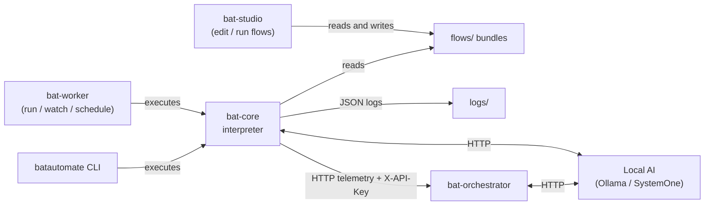
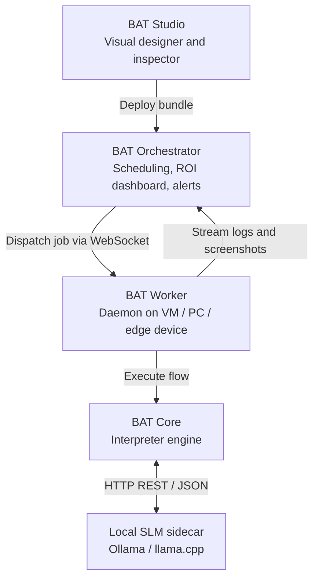
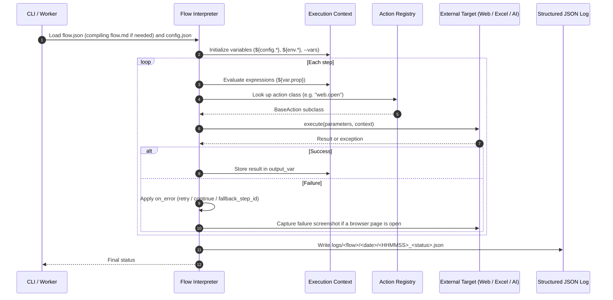

# Architecture

This document describes how BAT Automate is structured: its principles, modules, execution pipeline, AI integration, and the planned distributed architecture. It separates what exists today from the target design. For delivery status and priorities, see [roadmap.md](roadmap.md).

---

## 1. Core Principles

- **Local AI-Native:** Designed for on-device Small Language Models (SLMs) running on CPU (e.g. Qwen 2.5, Llama 3.2 via Ollama, llama.cpp, or ONNX). AI powers extraction, decision steps, and failure diagnosis with no cloud token costs and no business data leaving the network.
- **Deterministic first, agentic second:** Flows execute deterministically step by step. AI is used inside explicit actions (`ai.*`) or as an observer, never as a hidden replacement for flow logic.
- **Zero-license Office dependency:** Spreadsheet processing uses file-level libraries (`openpyxl`, `pandas`). Microsoft Excel or Microsoft 365 is never required.
- **Business-first telemetry:** Logs and dashboards report business outcomes (transactions, hours saved, cost saved), not only stack traces.
- **Free, unlimited workers:** No per-bot licensing. Workers run on any PC, VM, or edge device such as a Raspberry Pi.
- **Flows as code:** Flows are declarative JSON/Markdown files versioned in Git, not opaque binary packages.
- **Extensible in Python:** New actions are Python classes registered with the action registry.

---

## 2. Modules

| Module | Role | Current implementation | Target |
| :--- | :--- | :--- | :--- |
| **`bat-core`** | Flow interpreter, variable evaluator, action plugins, `batautomate` CLI | Python 3.10+, Pydantic, Playwright, openpyxl, pandas | Same |
| **`bat-worker`** | Runs flows unattended on target machines | CLI with `run`, `watch`, `schedule`, `daemon`; optional per-job sandbox workspace | Persistent WebSocket client receiving jobs from the Orchestrator |
| **`bat-studio`** | Flow authoring and debugging | FastAPI backend + React/Vite web UI: flow discovery, editing, validation, run | Tauri desktop shell, persistent browser sessions, element picker, live debugger |
| **`bat-orchestrator`** | Central monitoring and control | FastAPI + SQLAlchemy (SQLite default); receives heartbeats and telemetry over HTTP; web dashboard; AI failure summaries; API key auth | Job dispatch over WebSocket, PostgreSQL + Redis queue, ROI dashboard, LINE/Teams/Email alerts |

### Current Data Flow



### Target Architecture



---

## 3. Execution Pipeline (`bat-core`)



Key implementation files:
- Interpreter, error handling, retry and fallback: `bat-core/batautomate/engine/interpreter.py`
- Expression evaluation (no `eval`): `bat-core/batautomate/engine/evaluator.py`
- `flow.md` compiler: `bat-core/batautomate/engine/markdown.py` (spec: [flow_markdown_spec.md](flow_markdown_spec.md))
- Log writer and telemetry upload: `bat-core/batautomate/engine/logger.py` (format: [logging.md](logging.md))

Flows are organized as self-contained project bundles; see [project_bundles.md](project_bundles.md).

---

## 4. AI Integration

AI runs as a **decoupled sidecar**. `bat-core` stays lightweight and can run every non-AI flow without any ML runtime installed.

| Where | What it does | Implementation |
| :--- | :--- | :--- |
| Flow actions | `ai.prompt` (JSON-constrained prompts), `ai.extract` (structured fields from text or images), `ai.decide` | Ollama and OpenThai-SystemOne over HTTP (`bat-core/batautomate/actions/ai_*.py`) |
| Orchestrator | Classifies failures and suggests fixes from execution telemetry | `bat-orchestrator/services/ai_summarizer.py`, with a rule-based fallback when the LLM is unreachable |

See [actions_reference.md](actions_reference.md) for action parameters and [flows/examples/rpachallenge_ocr/](../flows/examples/rpachallenge_ocr/) for an end-to-end example.

Planned: self-healing selectors, a Studio copilot for natural-language flow authoring, and SLM diagnosis sent to LINE notifications.

---

## 5. Agent-to-Agent Hybrid Protocol (Planned)

Communication between the Orchestrator and Workers will use a **Hybrid Protocol**:

- **State envelope (JSON over WebSocket):** Deterministic machine fields (`type`, `job_id`, `status`, `metrics`, error codes) with state transitions `PENDING`, `RUNNING`, `SUCCESS`, `FAILED`. Workers never share state through mounted disks.
- **Cognitive payload (Markdown inside JSON):** An `agent_report_md` field carries a natural-language incident summary for AI agents and humans, used to decide recovery (auto-retry vs. human escalation).

```text
[ Worker Agent ] --- persistent WebSocket ---> [ Orchestrator Agent ]
{
   "type": "JOB_REPORT",
   "job_id": "job_20260916_001",
   "status": "FAILED",                        <-- JSON state envelope
   "duration": 14.2,
   "agent_report_md": "# Incident Summary\n"  <-- Markdown payload
                      "- **Root Cause:** Target input selector shifted.\n"
                      "- **Recommendation:** Trigger self-healing selector."
}
```

Today, workers send telemetry to the Orchestrator over HTTP (`POST /api/v1/telemetry`); see [orchestrator.md](orchestrator.md).

---

## 6. GitOps Deployment (Planned)

1. **Author:** Build and tune flows locally with the CLI or `bat-studio`.
2. **Version:** Commit `flow.json`, `flow.md`, `config/`, and assets to Git.
3. **Validate:** CI runs `pytest` and flow schema validation on every pull request.
4. **Release:** Orchestrator and workers pull approved, versioned bundles via Git tags, release branches, or webhooks.

---

## 7. Repository Layout

```text
BatAutomate/
├── bat-core/            # Runtime engine and CLI (batautomate)
│   ├── batautomate/
│   │   ├── actions/     # Web, Excel/CSV, file, HTTP, email, logic, flow, AI actions
│   │   ├── engine/      # Interpreter, evaluator, flow.md compiler, logger
│   │   └── models/      # Pydantic flow and context models
│   └── tests/
├── bat-worker/          # Unattended runner and triggers (batworker)
├── bat-studio/          # FastAPI backend (batstudio) + frontend/ (React/Vite)
├── bat-orchestrator/    # Central telemetry server and dashboard
├── flows/               # Project bundles; @shared/ holds reusable subflows
├── schemas/             # JSON schemas for flows and execution logs
├── docs/                # Documentation (index: docs/README.md)
├── logs/                # Execution logs (git-ignored)
├── .agents/rules/       # Engineering rules for AI assistants
└── AGENTS.md            # Entry point for AI assistants
```
